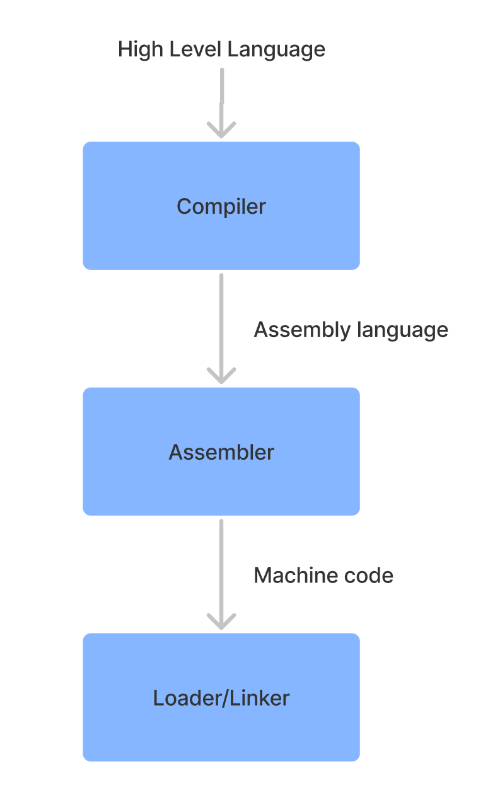

# what is programming language ? 

1. set of instructions 
2. set of logic in form of instructions 
3. set of syntax & logic 
4. c language is first name is 'B' language 
5. c language is a high level based language 

Note : compiler will confused if you can not assign any variable data types

```
a=10 //wrong way

int a=10, b=20, sum;  //right way

```


6. c langauge used as proggraming language

```
1. syntax
2. data structures
3. operator 
4. variables 
5. control or looping
6. functions
7. array & string
8. file handeling 

``` 


# what is c language

1. c langauge is very old language
2. c language is compiler based language 
3. c language compiler check proggrames step by step and convert highe level language into low level language.

**working of compiler in c language**      

**hello brijesh**

**Note : high level to binary code**   





# how to start c language 

1. start it header function 
2. start its syntax 
3. run c language proggrames used IDE or online compiler or DEV C

1. visual studio code  
2. online editor or compiler 
3. DEV C 

4. c language file extension .c 
5. c language is case-senstive language 


# simple proggrammes syntax 

**syntax of c language**

```
#include <stdio.h>
#include <conio.h>
Note : this is an header function library of c language
int main()
{
<!-- body of main function -->
printf("hello brijesh");
return 0; //terminate a proggrames 
}
```


# what is operator in c ?
1. operator operand some actions 
2. operator operate additions | substraction | comparisions | multiplications
3. types of operator 

1. airtmatic operator 

**examples of airthmatic operator**
```
examples : + , - ,* , / , % etc
``` 


2. assingment operator 

**examples of assingment operator**
```
examples : =, ==, != etc

```


3. comparision operator or relational operator

**examples of comparision operator**
```
examples : >, <, >=, <=, ===,  etc
```  


4. logical  operator 

**examples of logical operator**
```
examples : and && , or || , not !  etc
``` 


5. sorthand or betwise operator 

**examples of betwise operator**
```
examples : +=, -=, *= , %= , /=, >> ,<< etc
ex: a=10;
b=20;
a+=b; // a=a+b  
``` 	  


6. increment / decrement  operator 

**examples of increment/decrement**
```
examples : ++ , -- etc
post increment : a++
post decrement : a--
``` 

7. misslanious  operator 

```
sizeof :
* :
?: conditional operator or ternary operator
& : return an address of users
``` 		  


